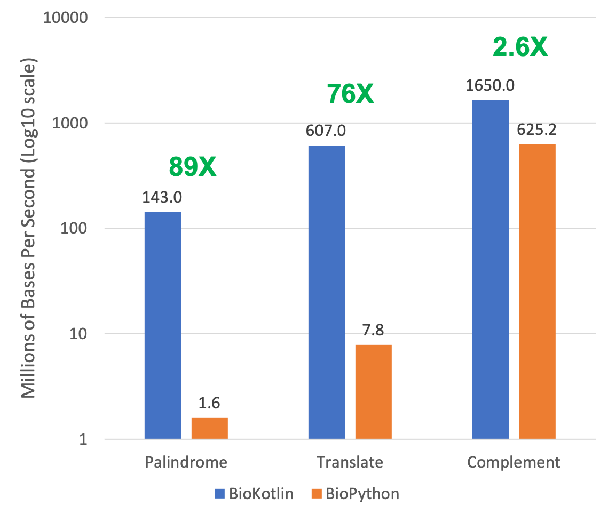

# Benchmarks

## Bioinformatics has a lot of data

We aim to process data fast. Kotlin is compiled on the fly (native compilation
is also possible), which allows it to be much faster than Python unless C code
is directly accessed. Here are three examples: searching for 6&nbsp;bp
palindromes, translating from DNA to protein, and complementing and
reverse-complementing sequences.

  <canvas id="benchmarks-throughput-chart" aria-label="Throughput in millions of bases per second, log scale: BioKotlin versus BioPython for palindrome search, translation, and complementation"></canvas>

  Throughput in millions of bases per second (log scale). Hover bars for values; click legend entries to show or hide a series.

<noscript>
  

    
  

</noscript>

| Operation | BioKotlin | BioPython | Speedup |
| --- | --: | --: | --: |
| Palindrome search (6&nbsp;bp) | 143.0 | 1.6 | 89&times; |
| Translate DNA to protein | 607.0 | 7.8 | 76&times; |
| Complement / reverse complement | 1650.0 | 625.2 | 2.6&times; |

Throughput is in millions of bases per second; higher is better.

When BioPython can rely on C code, as it does for complementation, BioKotlin is
only 2.6-fold faster. In the other cases, BioKotlin is nearly two orders of
magnitude faster.

## Memory

BioKotlin stores DNA sequences with only 2 bits per base pair, which can save
four- to eight-fold on RAM compared with the usual one-byte-per-base
representations, with only modest performance losses.
